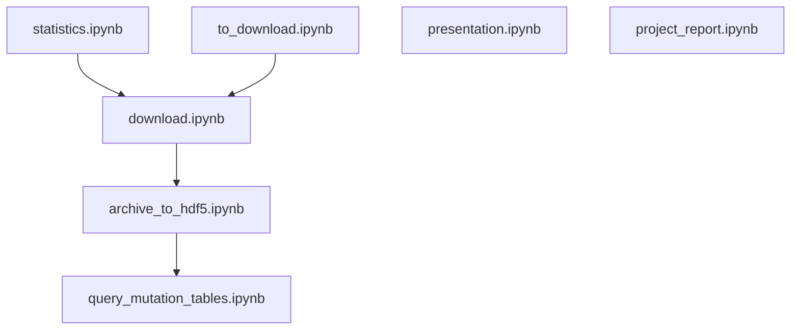

# PMC Tables Pipeline

**Note:** The data processing pipeline notebooks have been moved to the main [`pmc-tables`](https://github.com/pmc-tables/pmc-tables) repo. The `pmc-tables-pipeline` repo has been archived.

## Flowchart

## Description

This repository contains the pipeline for extracting and processing tables from [PubMed Central] and [Europe PMC].

[PubMed Central]: https://www.ncbi.nlm.nih.gov/pmc/
[Europe PMC]: https://europepmc.org/
